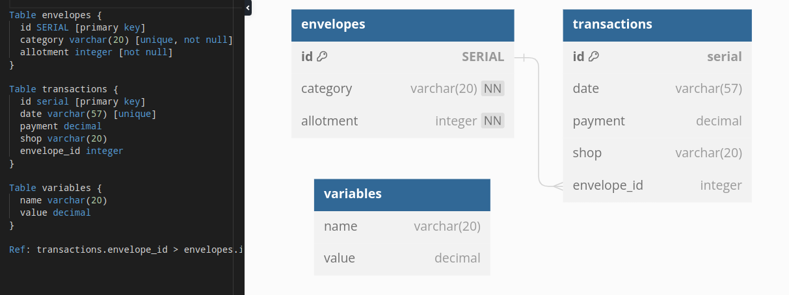
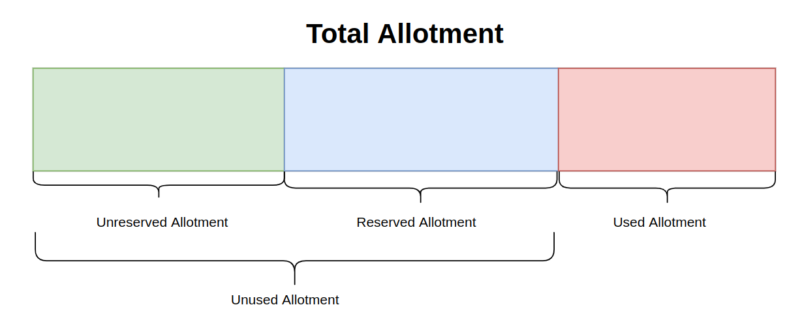

# Personal Budget II

In this project, I extended my previous GitHub project called 'Personal Budget' to create a Database to keep track of data for the API, connect the API to a Database, and document the API using Swagger. This API is for a personal Budget that follows the principles of Envelope Budgeting to manage personal finnances better. In this api you can create, review, update and delete digital envelopes and transactions that spend money allocated on the envelopes. The envelopes and transactions are both stored in a database with their respective tables. The schema for the database is show below:

## Features

In my project I made a feature that implements the total allotment that is made up of values as shown in the diagram below:

The meaining of the definitions are the following. Unreserved allotment is the total money that is unreserved to any envelope yet. Reserved allotment is the total money that is reserved by all the envelopes. Unused allotment is the sum of the unreserved and reserved allotment. Used allotment is the total money that is spent through making transactions. Total allotment is the sum of the unreserved allotment, reserved allotment, and used allotment.

The relation of these values are important due to the fact that adding envelopes moves funds from the unreserved category to the reserved catogory until all no money is left on the unreserved category. Similarly adding trasactions with payments removes allotment from the corresponding envelope therefore moving money from unreserved to used allotment.

You can read all of the allotment values shown on the previous diagram. But the only one you can update is the unused allotment to be greater than or equal to the reserved allotment, this linearly affects the total allotment and unreserved allotment. For example, if I update the unused allotment to be 10 dollars greater than the total allotment and unreserved allotment will now also be 10 dollars greater.

You can seed data into a emtpy database by adding data individually to the envelopes table and transactions table. The first thing you would need to do is check if the unused allotment is at least 325 $ for the envelopes about to be seeded, if not then update the unused allotment. If you would like to have seeded data with transactions be sure to first seed data for envelopes then transactions since the latter is dependent on the former. Which brings me to advise you that you can only delete envelopes if they have no transactions that are dependent on it. So make sure to delete trasactions that are dependent on the envelope you wish to delete or update the transactions so they depend on another envelope.

The last feature is your able to trasfer funds from the chosen "From" envelope to the "To" envelope that is less than or equal to the From envelope's allotment.

## How to use

To use first download the files, and install the dependencies. Dependencies include:

- morgan
- body-parser
- express
- Mocha
- Chai
- Sinon
- pg
- swagger-ui-express

Next we will create the database where the api stores information by first loggging into a superuser on postgres to create a login user with a name of 'budgeteer' and password of 'password'. Then logout of the super superuser to log into the new user just made to create a database named budget_api, connect to the new database, and enter the queries in the repository file "./server/db/db.sql" to create the neccesary tables. Keep in mind the choosing of the database user, their password, and database name can be to your choosing but you will have to change the corresponding credentials on the Pool function of top of the repository file './server/db/db.js'. Creating the database on postgres and connecting it to the api were steps that I closely followed from the following article [here](https://blog.logrocket.com/crud-rest-api-node-js-express-postgresql/), make sure to check it out.

Then you can run the api typing 'npm start' on the directory of this project. Some things to keep in mind while running the api:

- The first thing you should always do is to make sure there is enough unreserved allotment to create new envelopes.
- You can access my api documentation by calling the endpoint '/api-docs'
- When you run the tests I made it will automatically clear any previous data you might have. **SO DO NOT RUN THE TESTS BECAUSE IT WILL ERASE ALL THE DATAT YOU HAD.**

## Technologies

These are the technologies and/or frameworks used:

- Postgres - used this reltaional database to store the data
- Express.js - used this framework to create the api
- Node.js - used this Javascript runtime to write helper functions and connect to my database
- Visual studio code - used it as my code editor and test endpoints by uisng Thunder Client extension

## Collaborators

I had no collaborators

## License

MIT license

This is showed on the text file "LICENSE.txt" in the repository.
